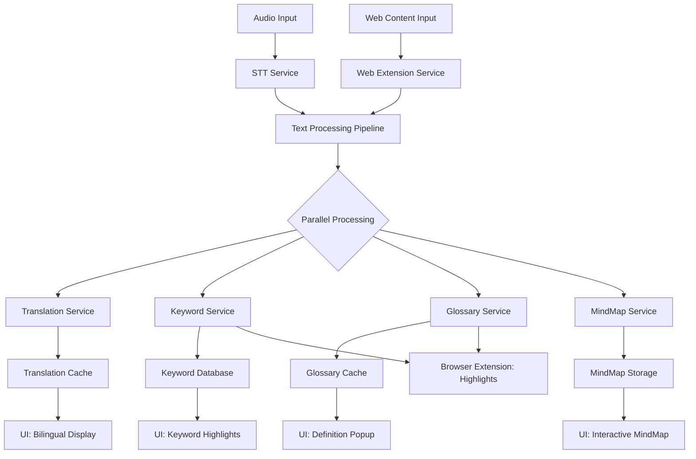

# Glass Enhanced - 新功能架构设计

## 🎯 功能需求概述

### 新增核心功能
1. **实时翻译功能** - 将识别的文字实时翻译并以双语形式显示
2. **关键词提取** - 自动识别并高亮显示重要术语和关键词
3. **术语解释** - 为关键词提供简短的上下文相关解释
4. **实时思维导图** - 根据对话内容自动生成和更新思维导图
5. **Chrome浏览器扩展** - 网页内容处理、提取分析、高亮标记和与主程序通信

## 🏗️ 系统架构设计

### 整体架构图
```
┌─────────────────────────────────────────────────────────────┐
│                    Enhanced Glass UI                        │
├─────────────────────────────────────────────────────────────┤
│  ┌─────────────┐  ┌─────────────┐  ┌─────────────┐  ┌─────│
│  │ Transcription│  │ Mind Map    │  │ Keywords    │  │ Tr..│
│  │ + Translation│  │ Viewer      │  │ Panel       │  │ ... │
│  └─────────────┘  └─────────────┘  └─────────────┘  └─────│ 
└─────────────────────────────────────────────────────────────┘
           │                 │                 │     ↑
           ▼                 ▼                 ▼     │ Web Data
┌─────────────────────────────────────────────────────────────┐
│                Enhanced Feature Services                    │
├─────────────────────────────────────────────────────────────┤
│  ┌─────────────┐  ┌─────────────┐  ┌─────────────┐  ┌─────│
│  │Translation  │  │MindMap      │  │Keyword      │  │Web  │
│  │Service      │  │Service      │  │Service      │  │Ext..│
│  └─────────────┘  └─────────────┘  └─────────────┘  └─────│
└─────────────────────────────────────────────────────────────┘
           │                 │                 │     ↑
           ▼                 ▼                 ▼     │
┌─────────────────────────────────────────────────────────────┐
│                  Data Processing Pipeline                   │
├─────────────────────────────────────────────────────────────┤
│  Audio/Web Input → Processing → Text Analysis → Features   │
│                     ┌─────────────────────────────────────┐ │
│                     │  ┌─────────┐ ┌─────────┐ ┌─────────┐│ │
│                     │  │Translate│ │Keywords │ │Structure││ │
│                     │  │ Engine  │ │Extractor│ │Analyzer ││ │
│                     │  └─────────┘ └─────────┘ └─────────┘│ │
│                     └─────────────────────────────────────┘ │
└─────────────────────────────────────────────────────────────┘
           │                                          ↑
           ▼                                          │
┌─────────────────────────────────────────────────────────────┐
│              Enhanced Data Storage Layer                    │
├─────────────────────────────────────────────────────────────┤
│  ┌─────────────┐  ┌─────────────┐  ┌─────────────┐  ┌─────│
│  │Translation  │  │Keywords &   │  │MindMap      │  │Web  │
│  │Cache        │  │Glossary     │  │Structures   │  │Data │
│  └─────────────┘  └─────────────┘  └─────────────┘  └─────│
└─────────────────────────────────────────────────────────────┘
                                                      ↑
┌─────────────────────────────────────────────────────────────┐
│                Chrome Browser Extension                     │
├─────────────────────────────────────────────────────────────┤
│  ┌─────────────┐  ┌─────────────┐  ┌─────────────┐         │
│  │Content      │  │Background   │  │Popup        │         │
│  │Scripts      │  │Service      │  │Interface    │         │
│  │(页面交互)   │  │(通信桥梁)   │  │(用户控制)   │         │
│  └─────────────┘  └─────────────┘  └─────────────┘         │
└─────────────────────────────────────────────────────────────┘
                              ↑
                    WebSocket/Native Messaging
```

## 🔧 模块化设计

### 1. 翻译服务模块 (TranslationService)
```javascript
// src/features/translation/translationService.js
class TranslationService {
    constructor() {
        this.providers = ['google', 'deepl', 'azure'];
        this.cache = new Map();
        this.currentLanguagePair = 'en-zh';
    }

    async translateText(text, sourceLang, targetLang) {
        // 实时翻译逻辑
    }

    async detectLanguage(text) {
        // 语言检测
    }

    setLanguagePair(source, target) {
        // 设置翻译语言对
    }
}
```

### 2. 关键词提取模块 (KeywordService)
```javascript
// src/features/keywords/keywordService.js
class KeywordService {
    constructor() {
        this.nlpProcessor = new NLPProcessor();
        this.domainKeywords = new Map();
        this.contextAnalyzer = new ContextAnalyzer();
    }

    async extractKeywords(text, context) {
        // 关键词提取算法
        // 1. TF-IDF算法
        // 2. 领域特定词汇识别
        // 3. 上下文相关性分析
    }

    async rankKeywords(keywords, context) {
        // 关键词重要性排序
    }

    async updateDomainModel(newKeywords) {
        // 动态更新领域模型
    }
}
```

### 3. 术语解释模块 (GlossaryService)
```javascript
// src/features/glossary/glossaryService.js
class GlossaryService {
    constructor() {
        this.definitionCache = new Map();
        this.contextualDefinitions = new Map();
        this.aiDefinitionGenerator = new AIDefinitionGenerator();
    }

    async getDefinition(term, context) {
        // 获取术语定义
        // 1. 缓存查找
        // 2. 上下文相关定义生成
        // 3. AI驱动的解释生成
    }

    async generateContextualDefinition(term, conversationContext) {
        // 基于对话上下文生成定义
    }

    async cacheDefinition(term, definition, context) {
        // 缓存定义
    }
}
```

### 4. 思维导图服务模块 (MindMapService)
```javascript
// src/features/mindmap/mindMapService.js
class MindMapService {
    constructor() {
        this.structureAnalyzer = new ConversationStructureAnalyzer();
        this.graphBuilder = new GraphBuilder();
        this.layoutEngine = new D3LayoutEngine();
    }

    async analyzeConversationStructure(transcript) {
        // 分析对话结构
        // 1. 主题识别
        // 2. 逻辑关系分析
        // 3. 层次结构构建
    }

    async updateMindMap(newContent, existingMap) {
        // 实时更新思维导图
    }

    async generateVisualization(structure) {
        // 生成可视化图表
    }
}
```

### 5. 网页扩展服务模块 (WebExtensionService)
```javascript
// src/features/webextension/webExtensionService.js
class WebExtensionService {
    constructor() {
        this.nativeMessaging = new NativeMessagingBridge();
        this.contentProcessor = new WebContentProcessor();
        this.highlightManager = new HighlightManager();
    }

    async setupNativeMessaging() {
        // 建立与Chrome扩展的通信
    }

    async processWebContent(data) {
        // 处理来自浏览器的网页内容
        // 1. 文本提取和清理
        // 2. 结构化内容分析
        // 3. 关键信息识别
    }

    async sendHighlightCommands(highlights) {
        // 发送高亮指令到浏览器扩展
    }

    async syncWebData(webData) {
        // 同步网页数据到主程序
    }
}
```

## 📊 数据流设计

### 核心数据流


### 实时数据同步
```javascript
// Enhanced Event System
class EnhancedEventBridge extends EventEmitter {
    constructor() {
        super();
        this.translationQueue = [];
        this.keywordQueue = [];
        this.mindmapQueue = [];
    }

    onTranscriptionUpdate(text) {
        // 并行触发所有增强功能
        this.emit('translation:process', text);
        this.emit('keywords:extract', text);
        this.emit('glossary:analyze', text);
        this.emit('mindmap:update', text);
    }
}
```

## 🛠️ 技术栈选择

### 后端技术栈选择方案

#### 方案A: 纯JavaScript/Node.js (推荐)
- **优势**: 与现有Glass代码完全兼容，无需额外运行时
- **翻译API**: Google Translate API, DeepL API, Azure Translator
- **NLP处理**: compromise.js, natural.js
- **图形处理**: D3.js, vis.js

#### 方案B: Python微服务
- **优势**: 更强大的NLP库支持
- **技术栈**: FastAPI + spaCy + NLTK + transformers
- **通信**: HTTP API或IPC通信
- **缺点**: 需要额外的Python运行时

#### 方案C: 混合架构
- **核心**: JavaScript保持与Glass集成
- **NLP处理**: Python微服务处理复杂NLP任务
- **通信**: WebSocket实时通信

### 前端UI技术栈
- **框架**: React + TypeScript (与现有一致)
- **样式**: Tailwind CSS (与现有一致)
- **图表库**: D3.js + React-D3-Graph
- **动画**: Framer Motion
- **状态管理**: React Context + useReducer

### 数据存储扩展
```sql
-- 新增数据表结构
CREATE TABLE translations (
    id INTEGER PRIMARY KEY,
    session_id TEXT,
    source_text TEXT,
    target_text TEXT,
    source_lang TEXT,
    target_lang TEXT,
    timestamp DATETIME,
    confidence REAL
);

CREATE TABLE keywords (
    id INTEGER PRIMARY KEY,
    session_id TEXT,
    keyword TEXT,
    importance_score REAL,
    context TEXT,
    timestamp DATETIME
);

CREATE TABLE glossary (
    id INTEGER PRIMARY KEY,
    term TEXT UNIQUE,
    definition TEXT,
    context TEXT,
    source TEXT,
    updated_at DATETIME
);

CREATE TABLE mindmap_nodes (
    id INTEGER PRIMARY KEY,
    session_id TEXT,
    node_id TEXT,
    content TEXT,
    parent_id TEXT,
    position_x REAL,
    position_y REAL,
    node_type TEXT,
    created_at DATETIME
);
```

## 🎨 UI/UX设计

### 四象限布局设计
```
┌─────────────────────┬─────────────────────┐
│                     │                     │
│   Transcription     │     Mind Map        │
│   + Translation     │     Viewer          │
│                     │                     │
│   [EN] Hello world  │     ┌─ Main Topic   │
│   [ZH] 你好世界     │     │  ├─ Subtopic  │
│                     │     │  └─ Action    │
├─────────────────────┼─────────────────────┤
│                     │                     │
│   Keywords Panel    │   Term Definitions  │
│                     │                     │
│   🔥 project (8.5)  │   📖 API: Application│
│   🔥 meeting (7.2)  │   Programming       │
│   🔥 deadline (6.8) │   Interface...      │
│                     │                     │
└─────────────────────┴─────────────────────┘
```

### 交互设计
1. **实时同步**: 所有四个面板实时更新
2. **关键词点击**: 点击关键词显示定义
3. **思维导图交互**: 拖拽、缩放、展开/折叠
4. **语言切换**: 快速切换翻译语言对
5. **导出功能**: 支持导出思维导图、术语表

## 🔌 集成策略

### 与现有Glass系统集成
1. **无侵入式集成**: 通过事件系统集成，不修改核心STT流程
2. **配置驱动**: 通过配置文件控制新功能开关
3. **渐进式启用**: 支持单独启用/禁用各个增强功能
4. **向后兼容**: 确保不影响原有功能

### 事件集成点
```javascript
// 在现有 listenService.js 中添加事件发射
handleTranscriptionComplete(speaker, text) {
    // 原有逻辑
    this.sendToRenderer('transcription-update', { speaker, text });
    
    // 新增：触发增强功能
    if (this.enhancedFeaturesEnabled) {
        this.eventBridge.emit('enhanced:transcription', {
            speaker,
            text,
            timestamp: Date.now(),
            sessionId: this.currentSessionId
        });
    }
}
```

## 📈 性能优化策略

### 实时性保障
1. **并行处理**: 翻译、关键词提取、结构分析并行执行
2. **增量更新**: 只处理新增的文本片段
3. **智能缓存**: 多层缓存策略减少重复计算
4. **异步处理**: 非阻塞的后台处理

### 内存管理
1. **滑动窗口**: 只保持最近的对话内容在内存中
2. **懒加载**: 按需加载历史数据
3. **垃圾回收**: 定期清理过期缓存

### 网络优化
1. **批量翻译**: 合并短文本片段批量翻译
2. **本地优先**: 优先使用本地NLP处理
3. **降级策略**: API失败时的备用方案

## 🌐 Chrome浏览器扩展架构

### Chrome扩展组件设计

#### 1. Manifest V3 配置
```json
{
  "manifest_version": 3,
  "name": "Glass Web Assistant",
  "version": "1.0.0",
  "description": "Glass learning assistant web extension",
  "permissions": [
    "activeTab",
    "storage",
    "scripting",
    "nativeMessaging"
  ],
  "host_permissions": [
    "http://*/*",
    "https://*/*"
  ],
  "background": {
    "service_worker": "background.js"
  },
  "content_scripts": [
    {
      "matches": ["<all_urls>"],
      "js": ["content.js"],
      "css": ["highlight.css"]
    }
  ],
  "action": {
    "default_popup": "popup.html"
  },
  "native_messaging": {
    "allowed_origins": ["chrome-extension://YOUR_EXTENSION_ID/"]
    }
}
```

#### 2. 内容脚本 (Content Script)
```javascript
// chrome-extension/content.js
class GlassContentScript {
    constructor() {
        this.isActive = false;
        this.highlightElements = new Map();
        this.textProcessor = new WebTextProcessor();
    }

    // 网页内容提取
    extractPageContent() {
        const content = {
            title: document.title,
            url: window.location.href,
            text: this.extractMainText(),
            structure: this.analyzePageStructure(),
            timestamp: Date.now()
        };
        return content;
    }

    // 高亮标记功能
    highlightText(keywords) {
        keywords.forEach(keyword => {
            this.highlightKeyword(keyword);
        });
    }

    // 与背景脚本通信
    sendToBackground(action, data) {
        chrome.runtime.sendMessage({
            action: action,
            data: data
        });
    }
}
```

#### 3. 背景服务 (Background Service)
```javascript
// chrome-extension/background.js
class GlassBackgroundService {
    constructor() {
        this.nativePort = null;
        this.isConnected = false;
    }

    // 建立与主程序的原生消息通信
    connectNativeApp() {
        this.nativePort = chrome.runtime.connectNative('com.pickle.glass.extension');
        
        this.nativePort.onMessage.addListener((message) => {
            this.handleNativeMessage(message);
        });

        this.nativePort.onDisconnect.addListener(() => {
            this.isConnected = false;
            console.log('Native app disconnected');
        });
    }

    // 处理来自内容脚本的消息
    handleContentMessage(message, sender, sendResponse) {
        switch(message.action) {
            case 'extractContent':
                this.sendToNativeApp('webContent', message.data);
                break;
            case 'highlight':
                this.sendHighlightToTab(sender.tab.id, message.data);
                break;
        }
    }

    // 发送数据到主程序
    sendToNativeApp(type, data) {
        if (this.nativePort && this.isConnected) {
            this.nativePort.postMessage({
                type: type,
                data: data
            });
        }
    }
}
```

### Native Messaging 配置

#### 主程序端Native Host配置
```json
{
  "name": "com.pickle.glass.extension",
  "description": "Glass Web Extension Native Host",
  "path": "/Applications/Glass.app/Contents/MacOS/native-host",
  "type": "stdio",
  "allowed_origins": [
    "chrome-extension://YOUR_EXTENSION_ID/"
  ]
}
```

#### 通信协议设计
```javascript
// 消息格式规范
const MessageTypes = {
    // 从扩展到主程序
    WEB_CONTENT: 'webContent',        // 网页内容数据
    HIGHLIGHT_REQUEST: 'highlight',    // 高亮请求
    USER_ACTION: 'userAction',        // 用户操作

    // 从主程序到扩展
    KEYWORDS: 'keywords',             // 关键词列表
    DEFINITIONS: 'definitions',        // 术语定义
    HIGHLIGHT_DATA: 'highlightData'   // 高亮数据
};
```

### 网页学习场景优化

#### 1. 在线课程支持
- 视频平台检测（YouTube, Coursera, edX等）
- 字幕提取和同步
- 课程进度跟踪
- 笔记关联功能

#### 2. 文档阅读优化
- PDF在线阅读器支持
- 学术论文结构识别
- 参考文献自动提取
- 阅读进度保存

#### 3. 多语言学习场景
- 自动语言检测
- 实时翻译显示覆盖
- 生词本功能
- 语言学习进度追踪

## 🔗 扩展与主程序集成

### 数据同步策略
```javascript
// 在现有 listenService.js 中添加Web扩展支持
handleWebContent(webData) {
    // 原有音频处理逻辑
    this.sendToRenderer('transcription-update', audioData);
    
    // 新增：处理Web内容
    if (this.enhancedFeaturesEnabled && webData) {
        this.eventBridge.emit('enhanced:webContent', {
            content: webData.text,
            url: webData.url,
            timestamp: Date.now(),
            sessionId: this.currentSessionId
        });
    }
}
```

### 统一的增强功能触发
```javascript
// 统一处理音频和Web内容
onContentUpdate(source, data) {
    // source: 'audio' | 'web'
    // 并行触发所有增强功能
    this.emit('translation:process', data);
    this.emit('keywords:extract', data);
    this.emit('glossary:analyze', data);
    this.emit('mindmap:update', data);
    
    // Web特定处理
    if (source === 'web') {
        this.emit('webextension:highlight', data);
    }
}
```

此架构设计确保了新功能的高度模块化、可扩展性和与现有系统的无缝集成，同时新增的Chrome浏览器扩展功能为网页学习场景提供了强大的支持。